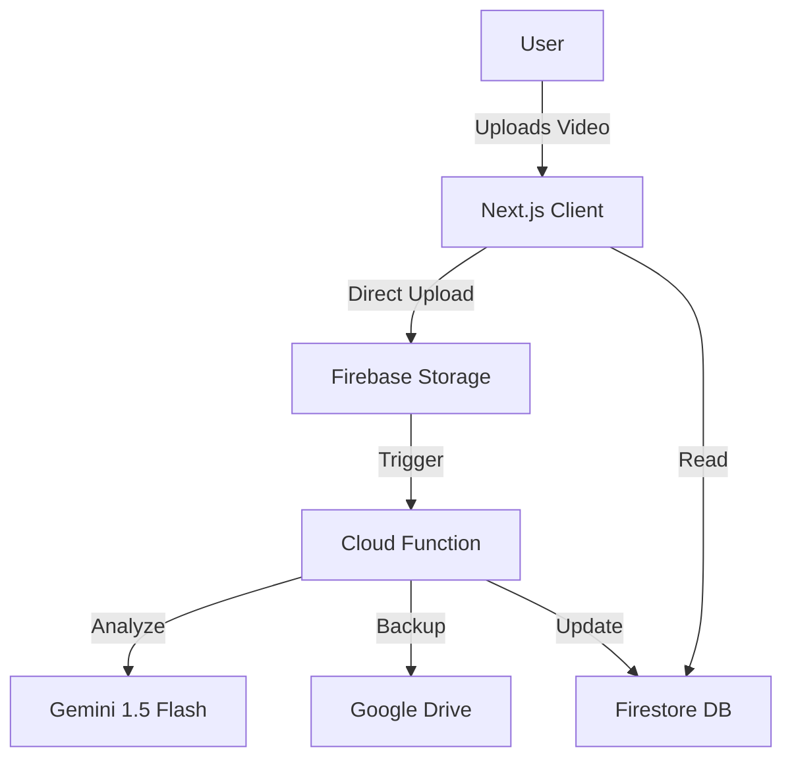

# CADA Films Website & CMS

The official website for CADA Films, designed to attract, inform, and direct users to CADA's productions.

Powered by "Project Antigravity", a custom Headless Podcast CMS that handles 2GB+ video uploads via Next.js + Firebase without Vercel timeouts.

## 🚀 Features
- **Direct-to-Cloud Uploads**: Bypasses Vercel server limits using `uploadBytesResumable`.
- **AI Analysis**: Gemini 1.5 Flash analyzes video content for summaries, chapters, and show notes.
- **Automated Backups**: Backs up every episode to Google Drive.
- **RSS Generation**: Automatically updates the RSS feed for podcast distribution.
- **Social Pack**: One-click copy for YouTube and X metadata.

## 🏗️ Architecture



## 🛠️ Setup & Deployment

### Prerequisites
1.  **Firebase Project**: Create a project on the Blaze plan (required for external APIs).
2.  **Google Cloud APIs**: Enable "Google Drive API" and "Vertex AI API" in the Google Cloud Console.
3.  **Authentication**: Enable Email/Password authentication in Firebase Console.

### Environment Variables & Secrets
**Security Note**: Never commit service account keys or secrets to the repository.

1.  **Frontend (.env.local)**:
    Create a `.env.local` file in the root directory:
    ```env
    NEXT_PUBLIC_FIREBASE_API_KEY=your_api_key
    NEXT_PUBLIC_FIREBASE_AUTH_DOMAIN=your_project_id.firebaseapp.com
    NEXT_PUBLIC_FIREBASE_PROJECT_ID=your_project_id
    NEXT_PUBLIC_FIREBASE_STORAGE_BUCKET=your_project_id.appspot.com
    NEXT_PUBLIC_FIREBASE_MESSAGING_SENDER_ID=your_sender_id
    NEXT_PUBLIC_FIREBASE_APP_ID=your_app_id
    ```

2.  **Backend (Cloud Functions)**:
    Use Firebase environment configuration for sensitive values:
    ```bash
    firebase functions:config:set drive.folder_id="your_drive_folder_id"
    ```
    *Note: For local development, you can use `firebase functions:config:get > .runtimeconfig.json` (ensure this file is gitignored).*

### Local Development Flow
1.  **Install Dependencies**:
    ```bash
    npm install
    cd functions && npm install && cd ..
    ```
2.  **Run Development Server**:
    ```bash
    npm run dev
    ```
    Access the app at `http://localhost:3000`.
3.  **Emulate Functions (Optional)**:
    If you need to test Cloud Functions locally:
    ```bash
    firebase emulators:start
    ```

### Deployment
1.  **Deploy Cloud Functions**:
    ```bash
    firebase deploy --only functions
    ```
2.  **Deploy Storage Rules**:
    ```bash
    firebase deploy --only storage
    ```
3.  **Deploy Frontend**:
    ```bash
    npm run build
    # Deploy to Vercel or Firebase Hosting
    ```

## ❓ Troubleshooting

### Large File Uploads
- **Issue**: Uploads fail or stall for files > 1GB.
- **Solution**:
    - Ensure you are using a stable internet connection.
    - The app uses `uploadBytesResumable` which handles network interruptions, but extremely poor connections may still time out.
    - Check the browser console for CORS errors. Ensure your `cors.json` allows the correct origin.

### AI Analysis Failures
- **Issue**: "Quota exceeded" or "Internal error" from Gemini.
- **Solution**:
    - Check your Google Cloud Quotas for Vertex AI.
    - Ensure the Cloud Function has the `Cloud Vertex AI User` role.

## 📂 Project Structure
- `/functions`: Cloud Functions (AI, RSS, Drive).
- `/src/app/admin/upload`: Admin dashboard.
- `/src/app/muit/[slug]`: Public episode page.
- `/src/lib`: Firebase SDK and converters.
- `/src/components`: UI components.

